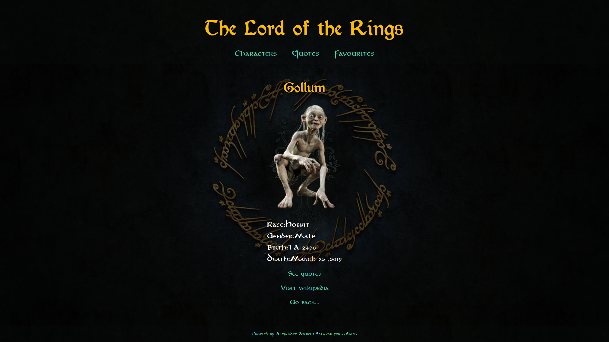

# LOTR Quotes

> Simple app to find Lord of the Rings characters and famous quotes.
> The app is hosted in heroku [_Click here to take a look._](https://quotes-lotr.herokuapp.com/)

## Table of Contents

- [General Info](#general-information)
- [Technologies Used](#technologies-used)
- [Features](#features)
- [Screenshots](#screenshots)
- [Setup](#setup)
- [Project Status](#project-status)
- [New features](#new-features)
- [Authors](#authors)

## General Information

### Context

The idea of the project was conceived during a hackathon at </Salt> bootcamp. Here, I incorporated different technologies we learned during the bootcamp to create a working app in a single day. After finishing the bootcamp, I updated the project to use more up-to-date technologies.

### Idea

Who doesn't love the Lord of the Rings? Who doesn't remember fondly Gollum's 'My Precious'? With this app, I wanted to create an easy way to find what Gollum, and all other characters, have said during this amazing trilogy.

## Technologies Used

### Front-end

- TypeScript
- React
- Next.JS
- Styled-JSX

### Deployment and hosting

- Vercel hosting

## Features

So far, I have incorporated the following features:

- Users can search through character by name or race.
- Users can search through quotes by text or character.
- Users can save quotes to favorites (saved on local storage).

## Screenshots

## Setup

The project is created in Next.JS, so the server runs as serverless functions. If anybody wants to clone this project, they can install dependencies running `yarn`, and then run the development server using `yarn dev`. A list with all scrips is found in the package.json file.

## Project Status

The project is currently finished, although there are several opportunities for improvement. Additional features might be added in the future.

## New features and bugs

Known bugs:

- Layout is not fully responsive.

Future features:

- Extensive menu for mobile.
- Fully-responsive layout.

## Authors

This project was created by myself:

- Alejandro Aburto Salazar - [GitHub](https://github.com/aburto22)
